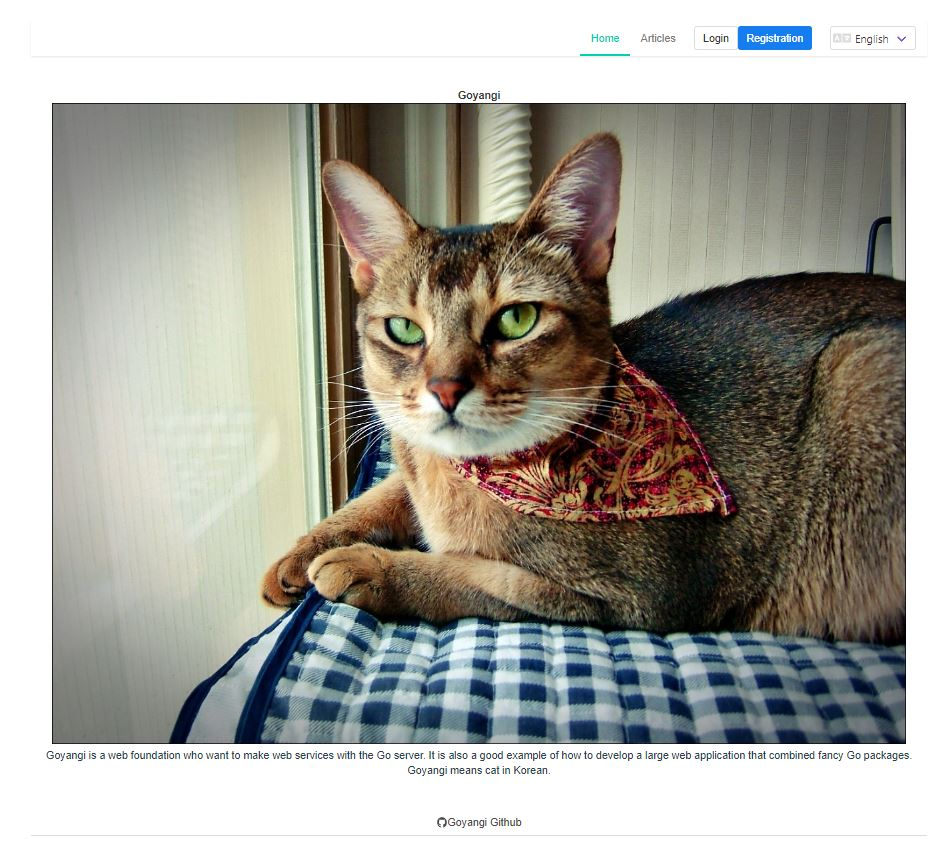
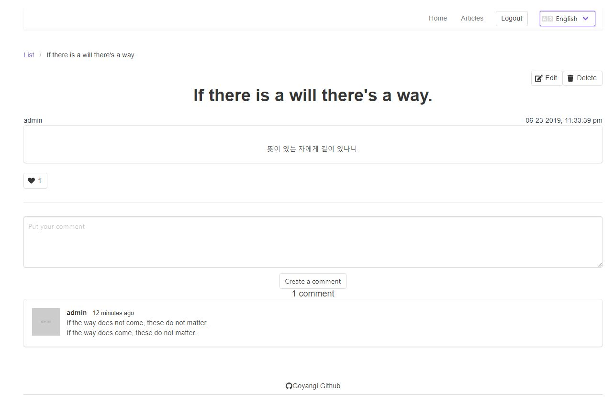

# Goyangi
[Goyangi](https://ko.wikipedia.org/wiki/%EA%B3%A0%EC%96%91%EC%9D%B4) means cat in Korean.

## The goal
The goal of Goyangi project is making a reliable foundation for developers who want to make web services with the Go server.
When the Goyangi project becomes more stable, developers would become lazybones.
Consequently, lazybones could not only show their creativity but also devote themselves to problems what they can solve.
It is also a good example of how to develop a large web application that combined fancy Go packages. 

## Why?
There are some good frameworks like magic([Beego](http://beego.me/), [Revel](http://revel.github.io/)...). However, these are too much.
Some developers prefer to using micro frameworks and lightweight packages for flexibility and performance.
It's not easy to select and combine packages though.
So, Goyangi carefully has chosen packages and combined.
Keep it simple and DRY.

## How it works?

## Update 2023
There are various remarkable projects for building API servers.
I tested some of them. Then came back to a simple API server starter Goyangi.
Even though Goyangi is an outdated project, I recognised that it still works properly.
Therefore, I decided to update Goyangi for better use.
* Update Golang modules
* Use Go modules rather than 'go dep'.
* Use '[slog](https://pkg.go.dev/golang.org/x/exp/slog)' rather than 'logrus'.
* Use '[Viper](https://github.com/spf13/viper)' Environment manager.
* Use Docker Compose.

## Getting Started (Docker)

### Pre installation
* [Docker](https://www.docker.com/) - Docker

### Run commands below
~~~
$ git clone github.com/dorajistyle/goyangi
$ cd goyangi
$ docker compose up -d --build
~~~

### Migration (First time only)
Please check your 'goyangi-backend' container logs first.
If you cannot connect to Postgres, restart the 'goyangi-backend' container.
Connect to http://localhost/api/v1/commands/migrate while running the server.

### Use
Connect to http://localhost

## Getting Started (cli)

### Pre installation
* [dep](https://github.com/golang/dep) - Install the dependency management for Go.
* [PostgreSQL](https://www.postgresql.org) - Install and run the postgresql service. [username: postgres / password: postgres]
* [yarn](https://yarnpkg.com) - Install a dependency management tool.

### Run commands below
~~~
$ git clone github.com/dorajistyle/goyangi
$ cd goyangi
$ go mod -U .
$ go mod tidy
~~~

### Edit config.yml file

### Run server
~~~
$ go run main.go
~~~

### Migration (First time only)
~~~
createdb goyangi_dev -U postgres;
createdb goyangi_test  -U postgres;
createdb goyangi  -U postgres;
~~~
Connect to http://localhost/api/v1/commands/migrate while running the server.

### Run frontend (Vue.js)
~~~
SOURCE_ROOT $ cd frontend/vuejs
VUE_JS_ROOT $ yarn
VUE_JS_ROOT $ yarn serve
~~~

### Default Login for Goyangi
* ID : admin
* password : password

## Features
* Restful support
* From Development to Deployment
* SPA ready

### Restful API

#### User
User is core of web application.
- [x] User CRUD
- [x] User Authentication
- [x] Oauth
- [x] User role for admin
- [x] Permissions handling to access each API
- [x] Email verification
- [x] Password reset via email
- [x] Following
- [x] Activation
- [x] MD5 for Gravatar
- [ ] Messaging

#### Article
It is a foundation of a basic content management system(CMS).
- [x] Article CRUD
- [x] Liking
- [x] Comment

#### Upload
It is a foundation of basic file upload.
- [x] Upload files to local storage
- [x] Upload files to amazon aws S3
- [x] Upload files metadata to database
- [ ] Upload files to other cloud servers
- [ ] Upload csv to database

##### Image
Image handling included in uploads function.
- [x] Resize (gift)
- [x] Filtering (gift)

##### App management for permissions
It would be a foundation of App management for permissions such as API call permission.
- [] -

#### Other API
We can add any foundation API we need.
- [ ] We can add any foundation code that is commonly used in web application.

### From Development to Deployment

#### Testing
- [x] BDD testing
~~~
   $ go run main.go test
~~~

#### API Document
Connect to http://localhost/swagger/index.html while running the server.

### SPA ready
Goyangi separates server and frontend clearly. And default SPA frontend used Vue.js.
However, developers can add frontend easily. Are you interested? Develop frontend and put it into 'frontend/' directory.

### Frontend Implemantation
|API|Server|Vuejs|
|--|--|--|
|User|all|registration,login,logout|
|Article|all|all|
|Upload|all|-|
|Image|all|-|

### Packages
Goyangi uses great open source packages. You can check that which packages used in Goyangi web foundation.

#### [Go Packages](./document/packages/backend.md)

#### [Frontend Packages](./document/packages/frontend.md)

### TODO
* [ ] Decide what functions should be maintained.
* [ ] Implement All server features in Vue.js frontend.
* [ ] Add tons of BDD tests
* [ ] Improve documentation
* [ ] Automatically ignore private configuration when commit using git filter for contributors.

### Contribution
Any contributions are more than welcome.

### Donation

________________________

## Attributions
Goyangi is under the [MIT license](./LICENSE)
